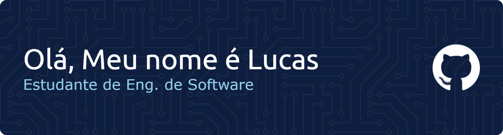

 
  
   </a> 

<!-- 
 
  
 	
  
-->

# Sobre Mim

Olá, me chamo Lucas e tenho 18 anos. Sou estudante de programação e estou me dedicando ao desenvolvimento web, buscando aprimorar minhas habilidades técnicas por meio de projetos práticos e estudos contínuos. Meu objetivo é crescer profissionalmente na área de tecnologia.

- 📖Desenvolvedor em formação
- 🔧Técnico de Desenvolvimento de Sistemas - SENAI
- 💻Engenharia de Software - UMC
- 🧑‍💻Apaixonado por tecnologia
- 🚀Sempre buscando evoluir.

# Linguagens de Programação e Feramentas
  

# Estatísticas
 

<picture align="center">
  <source media="(prefers-color-scheme: dark)" srcset="https://raw.githubusercontent.com/LucasSiq31/LucasSiq31/output/github-contribution-grid-snake-dark.svg">
  <source media="(prefers-color-scheme: light)" srcset="https://raw.githubusercontent.com/LucasSiq31/LucasSiq31/output/github-contribution-grid-snake-dark.svg">
  
</picture>

# ⭐Projetos

Aqui você vai encontrar projetos como: 
📌 Sistemas web simples 
📌 Jogos e aplicações em JavaScript 
📌 Exercícios e estudos de programação 
📌 Projetos acadêmicos 
Sempre tentando escrever código limpo e organizado.

## ✏️ Pixel Paint
> O PixelPaint é uma ferramenta web interativa para criação de Pixel Art, permitindo desenhar em grades personalizáveis, escolher cores e exportar suas artes digitalmente.

 

)

## 🪐 Saturn Sound
> O SaturnSound é um player de música web moderno e interativo, que permite gerenciar playlists, controlar a reprodução e visualizar faixas com uma interface temática e responsiva.

 

)

## 👻 GhostBlog
> O GhostBlog é uma interface de blog estática e minimalista, projetada para oferecer uma experiência de leitura limpa e sem distrações, com foco total na tipografia e na responsividade..

 

)
          
          
          
